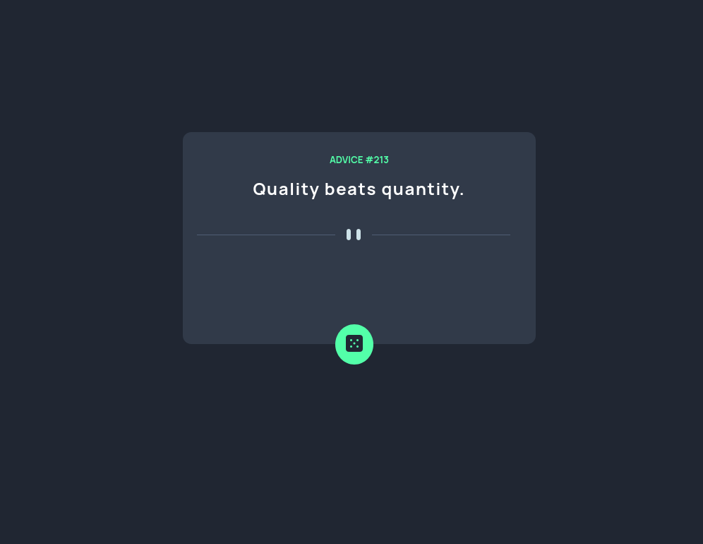

# Frontend Mentor - Advice generator app solution

This is a solution to the [Advice generator app challenge on Frontend Mentor](https://www.frontendmentor.io/challenges/advice-generator-app-QdUG-13db). Frontend Mentor challenges help you improve your coding skills by building realistic projects.

## Table of contents

- [Overview](#overview)
  - [The challenge](#the-challenge)
  - [Screenshot](#screenshot)
  - [Links](#links)
- [My process](#my-process)
  - [Built with](#built-with)
  - [What I learned](#what-i-learned)
  - [Continued development](#continued-development)
- [Author](#author)


## Overview

### The challenge

Users should be able to:

- Generate random advices by clicking a button.

### Screenshot



### Links

- Solution URL: [Add solution URL here](https://your-solution-url.com)
- Live Site URL: [Add live site URL here](https://your-live-site-url.com)

## My process

### Built with

- HTML5 markup
- CSS custom properties
- [React](https://reactjs.org/) - JS library
- [TypeScript](https://www.typescriptlang.org/) - TS library

### What I learned

With this project I got to practice my basic frontend skills, specially with React and TS. I still need to improve my CSS coding skills and make my projects better responsive. Its a working in progress.

code highlight:

```ts
function useFetch(url: string) {
  const [advice, setAdvice] = useState({ advice: '', id: 0 });

  useEffect(() => {
    axios.get(url).then((response) => setAdvice(response.data.slip));
  }, []);

  return { advice };
}
```

### Continued development

I realized that I need to keep practicing CSS. I'm still not confortable with my skills, I need to improve concepts like responsive web design. I also used this project as an opportunity to use Typescript, which is something that I'm just getting started with.


## Author

- Linkedin - [Gabriel Prates Peralta](https://www.linkedin.com/in/gabriel-pperalta/)
- Frontend Mentor - [@G-PPeralta](https://www.frontendmentor.io/profile/G-PPeralta)
